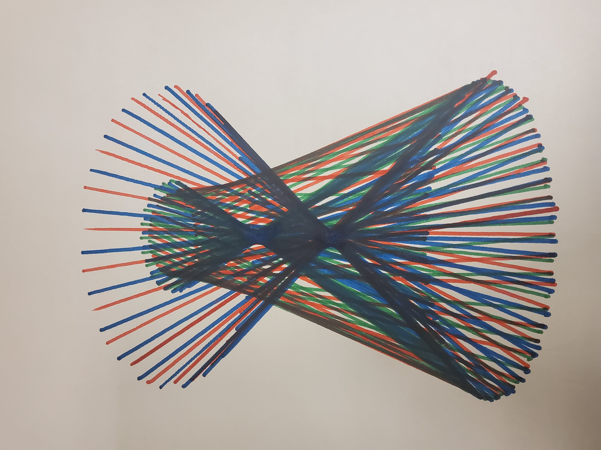
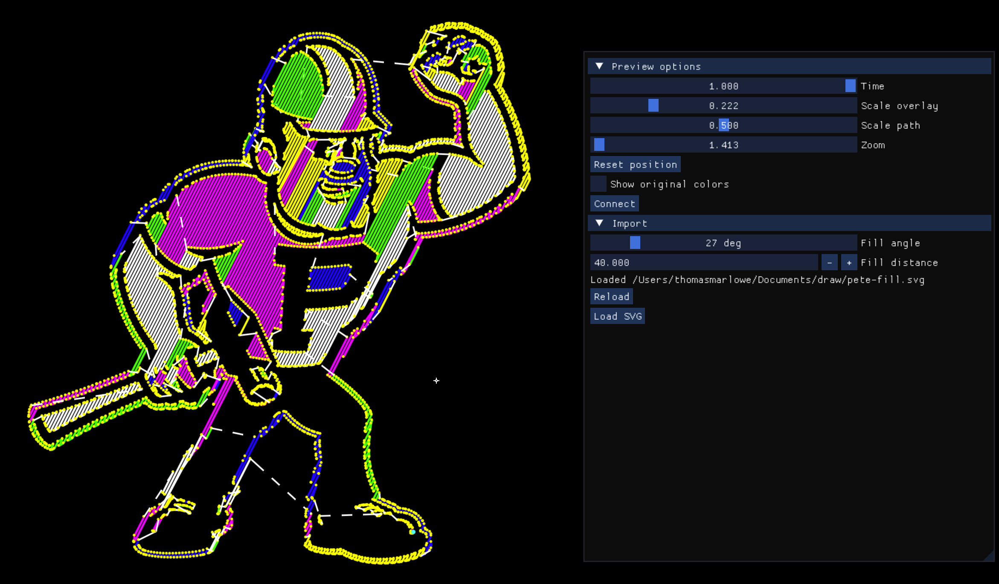

# Plotting firmware and GUI

I wiped the firmware from my [AliExpress plotter](https://www.aliexpress.us/item/3256805577136430.html) and decided it would be more fun to write it myself. The root directory you're in right now includes a C++ GUI (made with ImGui) for controlling the plotter with a primitive language, loading SVGs, filling shapes (with my own monotone polygon decomposition), multiple colors and more. The actual firmware is in [plotter](./plotter), which runs on an Arduino with PlatformIO (currently Uno/Due but this is trivial to change). It works about as well as a $100 plotter should:

Here's an outdated screenshot of the UI:
